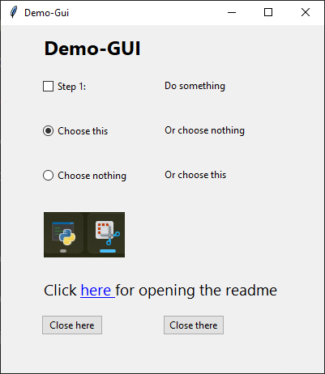
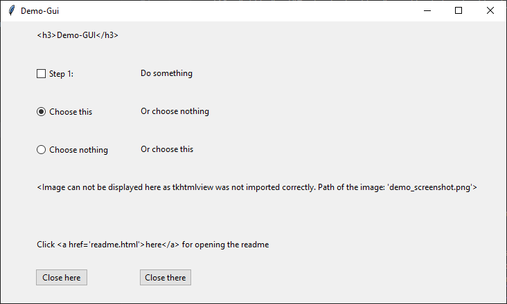

# GUI-Wrapper

> Archive for quick & easy GUI development with tkinter, if wished so with tkHtml as well.
> 
> Provides a class to build a GUI quickly row-by-row with TKinter.
> 
> The ways to access to the most common elements (for my useCases) are shortend a bit...

- [GUI-Wrapper](#gui-wrapper)
- [Available keywords for tuple in elements:](#available-keywords-for-tuple-in-elements)
  - [Available options for ELEMENT\_KEYWORD and corresponding datatype/structure for its PARAM:](#available-options-for-element_keyword-and-corresponding-datatypestructure-for-its-param)
- [Examples / Usage:](#examples--usage)
- [Prerequirements](#prerequirements)

This project is still in progress... There are a few known issues, as I just started to elaborate this module for my 'every-now-and-then-applications' in which I want to use only tkinter -- When it grows more, I often fall back on PySimpleGui, which is actually the general idea of construction a layout of the window. (maybe this is just unneccessary - but then it was a nice practise for me at least ;-)

# Available keywords for tuple in elements:

    - "lbl"      : Param:  "caption_for_label"          
    - "btn"      : Param:  ("caption", command_function)
    - "cmb"      : Param:  ("option1", "option2")       
    - "chkbx"    : Param:  ["lbl_caption", tk.IntVar()] 
    - "radiobtn" : Param:  ["lbl_caption", tk.IntVar()] 
    - "sep"      : Param:  vertical_distance 
    - "lbl_html" : Param:  "caption <u> with </u> html"   
    - "img_html" : Param:  "path/to/image/source.png"  
    - "txt"      : Param:  ??? # TODO...                

- Structure of each tuple of the tuple in elements: 
  - `(x_position, ELEMENT_KEYWORD, PARAM)` 
- with the followiing datatypes: 
  - `(int, str, DEPENDS_ON_ELEMENT)`

## Available options for ELEMENT_KEYWORD and corresponding datatype/structure for its PARAM:

KEYWORD    | element       | datatype of PARAM| example & meaning of PARAM    |
-----------|---------------|---------|-------------------------------|
"lbl"      | label         | str     | "caption_for_label"           |
"btn"      | button        | tuple   | ("caption", command_function) |
"cmb"      | combobox      | tuple   | ("option1", "option2")        |
"chkbx"    | checkbox      | tuple   | ["lbl_caption", tk.IntVar()]  |
"radiobtn" | radiobutton   | tuple   | ["lbl_caption", tk.IntVar()]  |
"sep"      | seperatorline | int     | vertical_distance             |
"txt"      | Entry         | ???     | # TODO...                     |
"lbl_html" | label (html)  | str     | "caption \<u> with \</u> html"  |
"img_html" | image (html)  | str     | "path/to/image/file.png"      |

# Examples / Usage:

    
Example for a row with following elements in the row (from left to right):
  - checkbox with a label
  - label 
  - button with a label on it and the command=sys.exit

  Thereby self.root is a tk.Tk object and implemented in an extra class.
  By the method 'get_last_y' the last y-position will be stored in y,
  so this y can be used for the next row (with adding an offset before...)

  All needed tk-Variables have to be initialized (and optionally they have
  to be set to an initial value)  before calling this method, 
  so that the variable can be passed into the constructor.
    
    self.state_checkbox = tk.IntVar() 

    y = GuiElementsRow(root=self.root, y=10, elements=[
        (10, "chkbx", ("Text of checkbox", self.state_checkbox)),
        (100, "lbl", "This is the caption of the label"),
        (200, "btn", ("Cancel", sys.exit)),
    ]).get_last_y()

# Prerequirements

- Nothing at all except a python (> 3.x.y) distrubtion.

- In order to use the html-elements as well, you will have to install tkhtmlview:

        `pip install tkhtmlview`

- Without this module you can use all elements, it won't raise an error, but print a warning, that you will not be able to render html. If you use html-elements, they will be redirected to "usual" Tkinter elements such as labels.